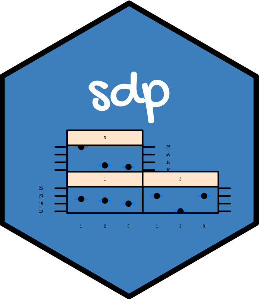

<!-- README.md is generated from README.Rmd. Please edit that file -->

# sdp <a href='https://liangliangzhuang.github.io/sdp/'></a>

<!-- badges: start -->
<!-- badges: end -->

## Overview

The goal of sdp is to provide engineers with practical guidance on how
to analyze data using common degradation models: Wiener process, Gamma
process, and Inverse Gaussian process. For each degradation process, we
provide data simulation generation, statistical inference, and remaining
useful life prognostics.

## Installation

You can install the development version of sdp from
[GitHub](https://github.com/) with:

``` r
# install.packages("devtools")
devtools::install_github("liangliangzhuang/sdp")
```

## Get started

``` r
library(sdp)
## basic example code
```

sdp functions fall into five main categories:

- “Simulation” which can simulate a group of degradation models, see
  `sim_dat()`.

- “Inference” which contains maximum likelihood estimator (MLE) and
  Bayesian method, see `sta_infer()`.

- “Ploting” which contains several visualization functions, mainly for
  plotting degradation paths, reliability and remaining useful life. See
  `plot_path()`, `RUL_plot()`, `Reliability_plot()`,
  `Reliability_cowplot()`, and `RUL_3D_density()`.

- “Others” which contains some useful functions. See `cumsub()`, and
  `acc_stress()`.

## Articles

- [Real data
  analysis](https://liangliangzhuang.github.io/sdp/docs/articles/Real-data-analysis.html)

- [Simulation data
  analysis](https://liangliangzhuang.github.io/sdp/docs/articles/Simulation-data-analysis.html)

## Getting help

If you encounter a clear bug, please file an issue with a minimal
reproducible example on
[GitHub](https://github.com/tidyverse/dplyr/issues).

<!-- --- -->
<!-- Please note that this project is released with a [Contributor Code of Conduct](https://dplyr.tidyverse.org/CODE_OF_CONDUCT). -->
<!-- By participating in this project you agree to abide by its terms. -->
