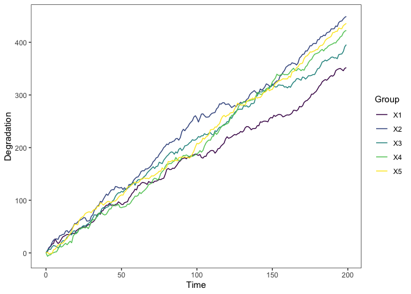
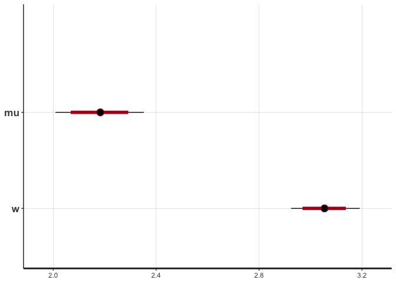
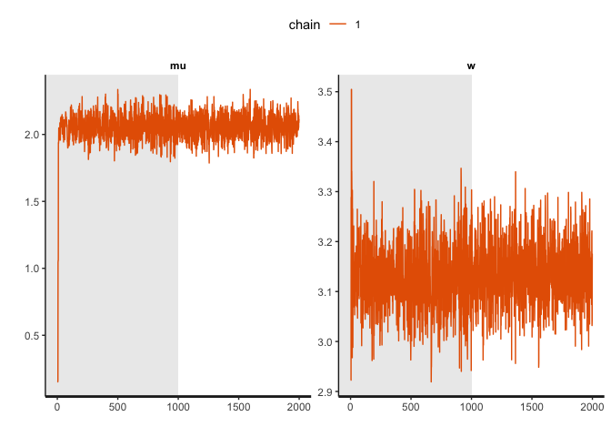
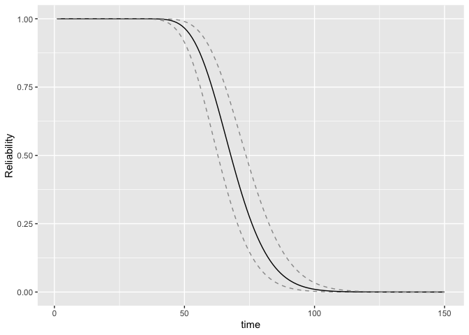

<!-- README.md is generated from README.Rmd. Please edit that file -->
<!-- badges: start -->
<!-- badges: end -->

# Overview

The goal of sdp is to provide engineers with practical guidance on how
to analyze data using common degradation models: Wiener process, Gamma
process, and Inverse Gaussian process. For each degradation process, we
provide data simulation generation, statistical inference, and remaining
useful life prognostics.

## Installation

You can install the development version of sdp from
[GitHub](https://github.com/) with:

``` r
# install.packages("devtools")
devtools::install_github("liangliangzhuang/sdp")
```

## Getting started

``` r
library(sdp)
## basic example code
```

sdp functions fall into five main categories:

- “Simulate” which can simulate a group of degradation.

- “Inference” which contains maximum likelihood estimator (MLE) and
  Bayesian method.

- “Plot” which contains several visualization functions, mainly for
  plotting degradation paths, reliability and remaining useful life. See
  `plot_path()`, `RUL_plot()`, `Reliability_plot`,
  `Reliability_cowplot()`, and `RUL_3D_density()`.

- “Others” which contains some useful functions. See `cumsub()`.

## Example: Simulated Data

This is a basic example which shows you how to solve a common problem.

We use `sim_dat()` to generate a simulated Wiener degradation process,
where group is 6, time epoch is `t = 1:200`. We denote the parameters
are $\mu = 2, \sigma = 3$. The output is a list: (i) first part of the
list is the amount of degradation of the simulated data, (ii) second
part is the increment of its degradation.

``` r
dat = sim_dat(group = 6, t = 1:200, para = c(2,3),process = "Wiener")
str(dat)
#> List of 2
#>  $ :'data.frame':    200 obs. of  7 variables:
#>   ..$ Time: num [1:200] 0 1 2 3 4 5 6 7 8 9 ...
#>   ..$ 1   : num [1:200] 0 1.37 5.01 9.11 8.95 ...
#>   ..$ 2   : num [1:200] 0 0.894 2.037 15.414 12.296 ...
#>   ..$ 3   : num [1:200] 0 -0.527 5.003 9.684 14.833 ...
#>   ..$ 4   : num [1:200] 0 1.24 3.43 5.45 4.48 ...
#>   ..$ 5   : num [1:200] 0 6.16 11.92 10 13.23 ...
#>   ..$ 6   : num [1:200] 0 1.99 -1.85 5.37 8.91 ...
#>  $ :'data.frame':    200 obs. of  7 variables:
#>   ..$ Time: num [1:200] 0 1 2 3 4 5 6 7 8 9 ...
#>   ..$ 1   : num [1:200] 0 1.365 3.644 4.1 -0.165 ...
#>   ..$ 2   : num [1:200] 0 0.894 1.143 13.377 -3.118 ...
#>   ..$ 3   : num [1:200] 0 -0.527 5.53 4.681 5.148 ...
#>   ..$ 4   : num [1:200] 0 1.237 2.19 2.027 -0.977 ...
#>   ..$ 5   : num [1:200] 0 6.16 5.76 -1.91 3.22 ...
#>   ..$ 6   : num [1:200] 0 1.99 -3.84 7.21 3.54 ...
```

Using `plot_path()` function to plot the simulated degradation data.

``` r
plot_path(dat[[1]])
```


The object is a ggplot, so you can add other related function to change
the plot. For example, let’s change the theme pattern.

``` r
plot_path(dat[[1]]) + theme_bw() +
  theme(panel.grid = element_blank())
```



### Inference

For this section, we provide a tutorial for parameter estimates using
MLE and Bayesian methods. Both methods are integrated in the
`sta_infer()` function and just need to be set in the `"method"`.

#### MLE

The output of MLE is the dataframe contains point and interval
estimates.

``` r
mle_fit = sta_infer(method = "MLE", process = "Wiener", type = "classical", data = dat[[1]])
mle_fit
#>         low   mean     up
#> [1,] 1.8831 2.0606 2.2380
#> [2,] 3.0025 3.1280 3.2534
```

#### Bayes

The output of Bayes is the resampling in `rstan`. According to this
object, we can do further process, e.g., prognostic, check an so on.

``` r
fit1 = sta_infer(method = "Bayes", process = "Wiener",type = "classical",data = dat[[1]])
#> Running /Library/Frameworks/R.framework/Resources/bin/R CMD SHLIB foo.c
#> clang -arch arm64 -I"/Library/Frameworks/R.framework/Resources/include" -DNDEBUG   -I"/Library/Frameworks/R.framework/Versions/4.2-arm64/Resources/library/Rcpp/include/"  -I"/Library/Frameworks/R.framework/Versions/4.2-arm64/Resources/library/RcppEigen/include/"  -I"/Library/Frameworks/R.framework/Versions/4.2-arm64/Resources/library/RcppEigen/include/unsupported"  -I"/Library/Frameworks/R.framework/Versions/4.2-arm64/Resources/library/BH/include" -I"/Library/Frameworks/R.framework/Versions/4.2-arm64/Resources/library/StanHeaders/include/src/"  -I"/Library/Frameworks/R.framework/Versions/4.2-arm64/Resources/library/StanHeaders/include/"  -I"/Library/Frameworks/R.framework/Versions/4.2-arm64/Resources/library/RcppParallel/include/"  -I"/Library/Frameworks/R.framework/Versions/4.2-arm64/Resources/library/rstan/include" -DEIGEN_NO_DEBUG  -DBOOST_DISABLE_ASSERTS  -DBOOST_PENDING_INTEGER_LOG2_HPP  -DSTAN_THREADS  -DBOOST_NO_AUTO_PTR  -include '/Library/Frameworks/R.framework/Versions/4.2-arm64/Resources/library/StanHeaders/include/stan/math/prim/mat/fun/Eigen.hpp'  -D_REENTRANT -DRCPP_PARALLEL_USE_TBB=1   -I/opt/R/arm64/include   -fPIC  -falign-functions=64 -Wall -g -O2  -c foo.c -o foo.o
#> In file included from <built-in>:1:
#> In file included from /Library/Frameworks/R.framework/Versions/4.2-arm64/Resources/library/StanHeaders/include/stan/math/prim/mat/fun/Eigen.hpp:13:
#> In file included from /Library/Frameworks/R.framework/Versions/4.2-arm64/Resources/library/RcppEigen/include/Eigen/Dense:1:
#> In file included from /Library/Frameworks/R.framework/Versions/4.2-arm64/Resources/library/RcppEigen/include/Eigen/Core:88:
#> /Library/Frameworks/R.framework/Versions/4.2-arm64/Resources/library/RcppEigen/include/Eigen/src/Core/util/Macros.h:628:1: error: unknown type name 'namespace'
#> namespace Eigen {
#> ^
#> /Library/Frameworks/R.framework/Versions/4.2-arm64/Resources/library/RcppEigen/include/Eigen/src/Core/util/Macros.h:628:16: error: expected ';' after top level declarator
#> namespace Eigen {
#>                ^
#>                ;
#> In file included from <built-in>:1:
#> In file included from /Library/Frameworks/R.framework/Versions/4.2-arm64/Resources/library/StanHeaders/include/stan/math/prim/mat/fun/Eigen.hpp:13:
#> In file included from /Library/Frameworks/R.framework/Versions/4.2-arm64/Resources/library/RcppEigen/include/Eigen/Dense:1:
#> /Library/Frameworks/R.framework/Versions/4.2-arm64/Resources/library/RcppEigen/include/Eigen/Core:96:10: fatal error: 'complex' file not found
#> #include <complex>
#>          ^~~~~~~~~
#> 3 errors generated.
#> make: *** [foo.o] Error 1
bayes_fit = rstan::summary(fit1)$summary[c(1,2),c(4,1,8)] #
bayes_fit
#>        2.5%     mean    97.5%
#> mu 1.885431 2.058223 2.222726
#> w  3.016682 3.132778 3.264447
# print(fit1, probs = c(0.025,0.5,0.975),pars = c("mu","w"))
rstan::plot(fit1)
```



``` r
rstan::traceplot(fit1,pars = c("mu","w"), inc_warmup = T,nrow = 1) + theme(legend.position = "top")
```



### Reliability and RUL

Based on the statistical inference, we use `Reliability()` and `RUL()`
to calculate the Reliability and RUL, respectively. Then using
`Reliability_plot()` and `RUL_plot()` to plot.

``` r
reb = Reliability(t = 50, threshold = 150,par = mle_fit,
                       process = "Wiener",type = "classical")
Reliability_plot(R_time = 1:150,sum_para = mle_fit,threshold = 150,
                 process = "Wiener",type = "classical")
```



``` r

rul = RUL(t = 1:100, cur_time = 100, threshold = 150, data = dat[[1]],
    par = mle_fit[,2], process = "Wiener", type = "classical")

RUL_plot(fut_time = c(50,55,60,65,70,75,80),time_epoch = 1:100,
                threshold = 150,zlim = c(0,0.05),xlim = c(0,100),
                para = mle_fit[,2],
                real_RUL=c(NA,NA,NA,NA,NA,NA)+40)
```


    #> $rect
    #> $rect$w
    #> [1] 0.2499835
    #> 
    #> $rect$h
    #> [1] 0.1139012
    #> 
    #> $rect$left
    #> [1] -0.1004324
    #> 
    #> $rect$top
    #> [1] 0.1683858
    #> 
    #> 
    #> $text
    #> $text$x
    #> [1] -0.02995602 -0.02995602 -0.02995602
    #> 
    #> $text$y
    #> [1] 0.13991046 0.11143515 0.08295984
